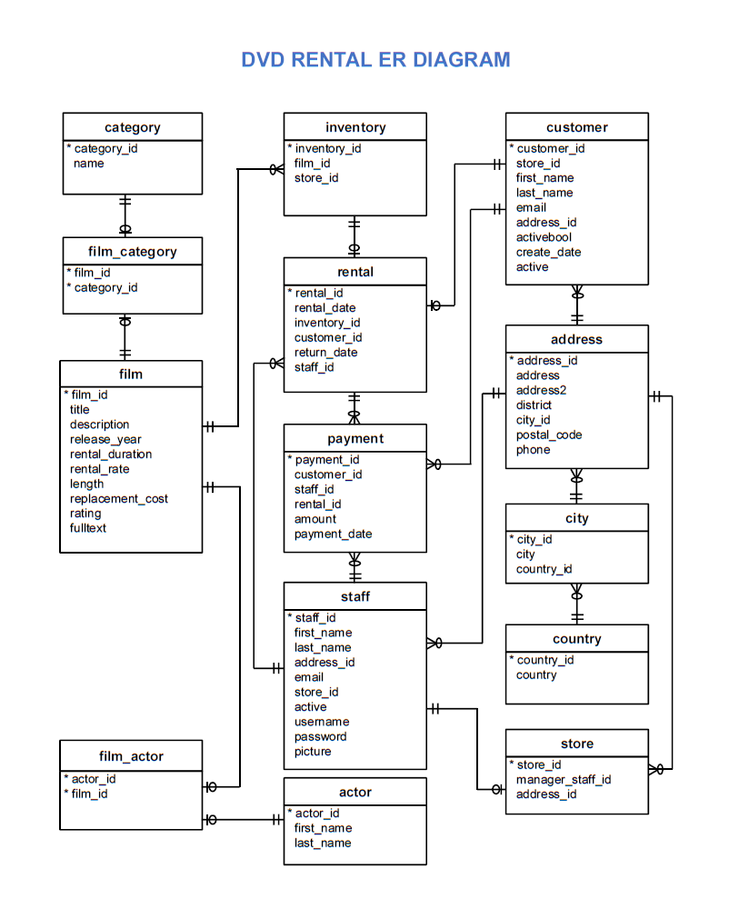

# Sakila-DVD-Rental-database
## Introduction 
In this project,will query the _Sakila DVD Rental_ database. 
The Sakila Database holds information about a company that rents movie DVDs.
For this project, you will be querying the database to gain an understanding of the customer base, 
such as what the patterns in movie watching are across different customer groups, how they compare on payment earnings,
and how the stores compare in their performance. To assist you in the queries ahead, the schema for the DVD Rental database is provided below.

## ERD diagram 

## Tools and technology
- PostgressSQL
- Excel

## Project Rubric
[CRITERIA](https://review.udacity.com/#!/rubrics/2095/view)
